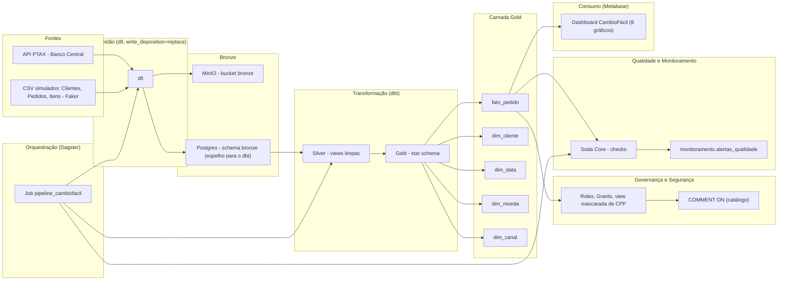

# CambioFácil — Plataforma de Operações de Câmbio para Viajantes

> Protótipo de Ciclo de Vida de Engenharia de Dados — Parte 1 (Planejamento e Desenho Arquitetural)
> Disciplina: Engenharia de Dados — CEUB

## Integrante

- **Nome completo:** João Victor Ferreira Marques
- **Matrícula:** 22303180

---

## 1. Descrição do Projeto

### Contexto de Negócio

O **CambioFácil** é uma fintech fictícia que ajuda pessoas físicas a comprarem moeda estrangeira para viagens internacionais. A plataforma utiliza como referência de preço a cotação oficial do dólar (PTAX), divulgada diariamente pelo Banco Central do Brasil, para precificar e processar pedidos de câmbio dos seus clientes.

### Problema

Clientes que precisam comprar moeda estrangeira para viagem frequentemente não têm visibilidade clara de quando a cotação está favorável, e a empresa precisa de um processo confiável, auditável e de baixo custo para capturar a cotação diária, consolidar os pedidos dos clientes e disponibilizar essas informações para análise e tomada de decisão.

### Objetivos Principais

- Automatizar a captura diária da cotação cambial (PTAX) a partir da API pública do Banco Central.
- Consolidar e organizar os dados de clientes e pedidos de câmbio da plataforma.
- Disponibilizar um painel de acompanhamento confiável para a área financeira da empresa.
- Garantir que os dados pessoais dos clientes (como CPF) sejam tratados com segurança e em conformidade com a LGPD.

### Stakeholders / Usuários Finais dos Dados

- **Clientes finais**: pessoas físicas que solicitam operações de câmbio na plataforma.
- **Time financeiro da fintech**: utiliza os dados consolidados para acompanhar volume de operações e variação cambial.
- **Área de compliance / governança**: responsável por garantir o tratamento adequado dos dados pessoais dos clientes.

---

## 2. Estrutura do Repositório

| Arquivo | Conteúdo |
|---|---|
| `docs/dados.md` | Definição e classificação das fontes de dados |
| `docs/dominios-servicos.md` | Domínios de negócio e serviços envolvidos |
| `docs/arquitetura.md` | Arquitetura, fluxo de dados e justificativas |
| `docs/tecnologias.md` | Tecnologias escolhidas e justificativas por etapa |
| `docs/modelagem-dados.md` | Modelagem conceitual/lógica dos dados (diagrama ER) |

---

## 3. Considerações Finais

### Riscos e Limitações

- A API PTAX do Banco Central pode alterar seu formato de resposta sem aviso prévio, exigindo ajustes no pipeline de ingestão.
- Os dados de clientes e pedidos são simulados (via biblioteca Faker), o que não captura toda a complexidade e os casos extremos de um sistema de produção real.
- O baixo volume de dados utilizado no protótipo pode mascarar problemas de performance que só se manifestariam em um ambiente de produção com maior escala.

### Próximos Passos (Parte 2)

- Subir a infraestrutura local via Docker Compose (PostgreSQL e MinIO).
- Implementar os scripts de ingestão com `dlt`.
- Implementar os modelos de transformação (Bronze → Silver → Gold) com `dbt`.
- Orquestrar a execução do pipeline com `Dagster`.
- Implementar os checks de qualidade de dados com `Soda Core`.
- Construir o dashboard de consumo no `Metabase`.

### Referências

- Material das Aulas 01 a 09 da disciplina de Engenharia de Dados (CEUB).
- Documentação oficial: dlt, dbt, Dagster, Soda Core e Metabase.
- Documentação da API PTAX do Banco Central do Brasil.

---

## Arquitetura As-Built

Abaixo está o diagrama do que foi **efetivamente implementado** na Parte 2, refletindo todos os ajustes feitos durante o desenvolvimento.

### Relatório de Mudanças em Relação ao Plano da Parte 1

Durante a implementação, algumas decisões técnicas foram ajustadas em relação ao planejamento original:

- **Bronze duplicado em dois destinos (MinIO + Postgres):** o plano original previa a camada Bronze apenas no MinIO. Na prática, o `dbt` só consegue transformar dados que estejam em um banco relacional — por isso, os mesmos dados brutos passaram a ser carregados também em um schema `bronze` no PostgreSQL. O MinIO continua sendo o "arquivo bruto oficial" (cópia fiel para fins de auditoria/arquivamento); o Postgres serve como ponte técnica para a transformação.
- **Nova dimensão: Canal de Venda:** não estava prevista na modelagem conceitual da Parte 1. Foi adicionada durante a implementação para enriquecer a análise de negócio, resultando em uma nova tabela dimensão (`dim_canal`) no star schema da camada Gold.
- **Carga idempotente (`write_disposition="replace"`):** inicialmente as cargas do `dlt` estavam configuradas para acumular dados a cada execução. Isso foi corrigido para sempre substituir os dados anteriores, evitando duplicação e inconsistência entre execuções do pipeline.
- **Volume de dados e variedade de moedas ampliados:** o volume inicial de dados simulados (50 clientes, 150 pedidos) foi ampliado (500 clientes, 3.000 pedidos), e a lista de moedas estrangeiras foi expandida de 3 para 8, com faixas de taxa de câmbio realistas por moeda — tornando o protótipo mais representativo de um cenário real.

---

## Como Rodar o Projeto (Reprodução)

1. **Pré-requisitos:** WSL2 + Docker Desktop + Python 3 (dentro do WSL2) + VS Code com extensão WSL.
2. **Clonar o repositório:**