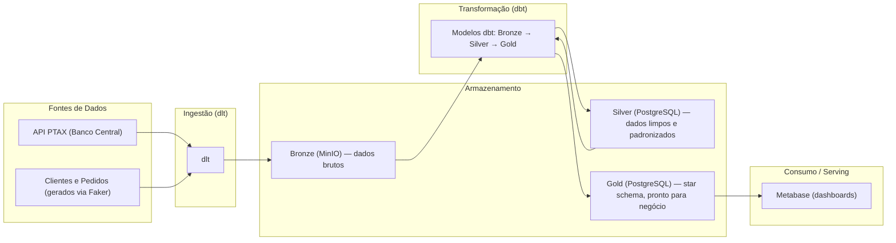

# Arquitetura — O que será feito (Fluxo de Dados)

## Diagrama de Arquitetura — Fluxo Ponta a Ponta

**Importante:** todo o fluxo acima é **100% batch**. Não existe nenhum caminho de streaming neste projeto — a justificativa detalhada para essa decisão está em `docs/dados.md`, seção 3.

---

## Detalhamento das Camadas (Arquitetura Medalhão)

| Camada | Conteúdo | Onde fica |
|---|---|---|
| **Bronze** | Cópia fiel e bruta dos dados de origem (API PTAX + CSVs simulados), com metadados de carga (data de carga, origem, ID do processo) | MinIO |
| **Silver** | Dados limpos, deduplicados e padronizados — uma visão corporativa consistente das entidades (clientes, pedidos, cotações) | PostgreSQL |
| **Gold** | Dados agregados e modelados em **star schema (Kimball)** — tabela fato de pedidos ligada a dimensões de cliente, data e moeda — prontos para consumo pelo negócio | PostgreSQL |

---

## Justificativa do Tipo de Arquitetura Escolhida

Optou-se pela **Arquitetura Medalhão** (Bronze, Silver e Gold), ensinada na Aula 05 da disciplina, em vez de alternativas como Lambda, Kappa ou Data Mesh, pelos seguintes motivos:

- **Lambda e Kappa** existem para conciliar processamento em tempo real com processamento em lote. Como já justificado em `docs/dados.md`, este projeto **não tem nenhuma necessidade real de processamento em tempo real** — adotar Lambda ou Kappa aqui adicionaria complexidade técnica (gerenciar dois sistemas distintos, ou uma plataforma de streaming) sem qualquer ganho prático para o negócio.
- **Data Mesh** é mais adequado para organizações grandes, com múltiplas equipes autônomas gerenciando seus próprios domínios de dados de forma descentralizada. Este é um protótipo de uma única equipe (um integrante), o que não justifica a complexidade organizacional de um Data Mesh.
- A **Arquitetura Medalhão** oferece o equilíbrio ideal para este cenário: separa claramente dados brutos, dados limpos e dados prontos para negócio, é simples de implementar com ferramentas leves e gratuitas, e é o padrão diretamente ensinado e validado em laboratório na disciplina.

---

## Discussão de Trade-offs

**Acoplamento:** baixo. Cada camada (Bronze, Silver, Gold) é independente — é possível alterar a lógica de uma camada sem impactar diretamente as demais, desde que o contrato de dados (schema) entre elas seja respeitado.

**Escalabilidade:** limitada, mas suficiente para o escopo do projeto. A arquitetura roda em containers Docker únicos (sem cluster ou alta disponibilidade), o que é adequado ao volume de dados de um protótipo educacional, mas não escalaria diretamente para um cenário de produção com grande volume.

**Disponibilidade:** simples e de ponto único — não há redundância de containers. Essa é uma limitação aceitável dado o contexto (protótipo acadêmico, sem SLA de produção), mas seria um ponto de melhoria necessário em um cenário real.

**Confiabilidade:** garantida principalmente por dois mecanismos — cargas idempotentes realizadas pelo `dlt` (evitando duplicação de dados em reprocessamentos) e verificações de qualidade automatizadas pelo `Soda Core`, que detectam inconsistências antes que cheguem à camada Gold.

**Reversibilidade:** alta. Por utilizar formatos abertos (Parquet/CSV no MinIO, tabelas relacionais padrão no PostgreSQL) e ferramentas desacopladas entre si, é possível substituir qualquer peça da arquitetura (por exemplo, trocar o PostgreSQL por outro banco, ou o Metabase por outra ferramenta de BI) sem reescrever o pipeline inteiro.
