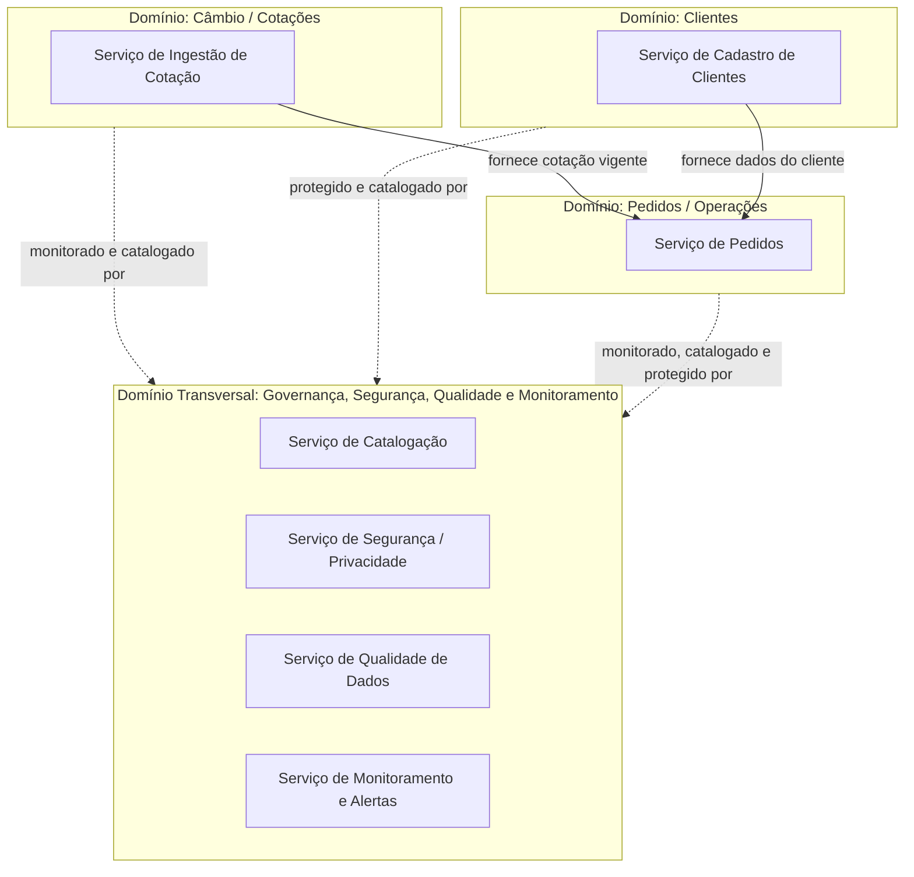

# Domínios e Serviços

## Domínios de Negócio Identificados

O projeto CambioFácil está organizado em três domínios de negócio principais, mais um domínio transversal responsável por governança, segurança, qualidade e monitoramento — que dá suporte aos demais.

### 1. Domínio: Câmbio / Cotações
Responsável por capturar e manter atualizada a referência de preço (cotação cambial) utilizada por toda a plataforma.

**Serviços:**
- **Serviço de Ingestão de Cotação**: consome diariamente a API PTAX do Banco Central e disponibiliza a cotação de compra e venda do dólar.

### 2. Domínio: Clientes
Responsável pelo cadastro e pelas informações das pessoas físicas que utilizam a plataforma.

**Serviços:**
- **Serviço de Cadastro de Clientes**: mantém os dados cadastrais (nome, CPF, e-mail, telefone) das pessoas físicas.

### 3. Domínio: Pedidos / Operações
Responsável pelo registro das operações de câmbio solicitadas pelos clientes.

**Serviços:**
- **Serviço de Pedidos**: registra cada operação de câmbio (moeda solicitada, quantidade, valor total, status, endereço de retirada/entrega), aplicando a cotação vigente do domínio de Câmbio/Cotações.

### 4. Domínio Transversal: Governança, Segurança, Qualidade e Monitoramento
Não pertence a uma área de negócio específica — atua **sobre os demais domínios**, garantindo que os dados produzidos por eles sejam confiáveis, seguros e bem documentados.

**Serviços:**
- **Serviço de Catalogação**: documenta a origem, o significado e a estrutura dos dados de cada domínio (via metadados e comentários no banco de dados).
- **Serviço de Segurança/Privacidade**: controla o acesso aos dados sensíveis (como o CPF dos clientes) e aplica mascaramento conforme exigido pela LGPD.
- **Serviço de Qualidade de Dados**: executa verificações automatizadas (checks) sobre os dados de todos os domínios.
- **Serviço de Monitoramento e Alertas**: observa a execução dos pipelines e sinaliza falhas ou problemas de qualidade.

---

## Serviços Compartilhados Entre Domínios

| Serviço | Compartilhado entre |
|---|---|
| Serviço de Catalogação | Todos os domínios |
| Serviço de Segurança/Privacidade | Clientes (dados pessoais) e Pedidos (dados sensíveis associados) |
| Serviço de Qualidade de Dados | Todos os domínios |
| Serviço de Monitoramento e Alertas | Todos os domínios |

---

## Diagrama de Domínios e Serviços

**Leitura do diagrama:** o Serviço de Pedidos depende diretamente da cotação vigente (Domínio Câmbio/Cotações) e dos dados cadastrais do cliente (Domínio Clientes) para registrar uma operação. O domínio transversal não participa do fluxo de negócio em si, mas observa, protege e documenta os três domínios operacionais.
