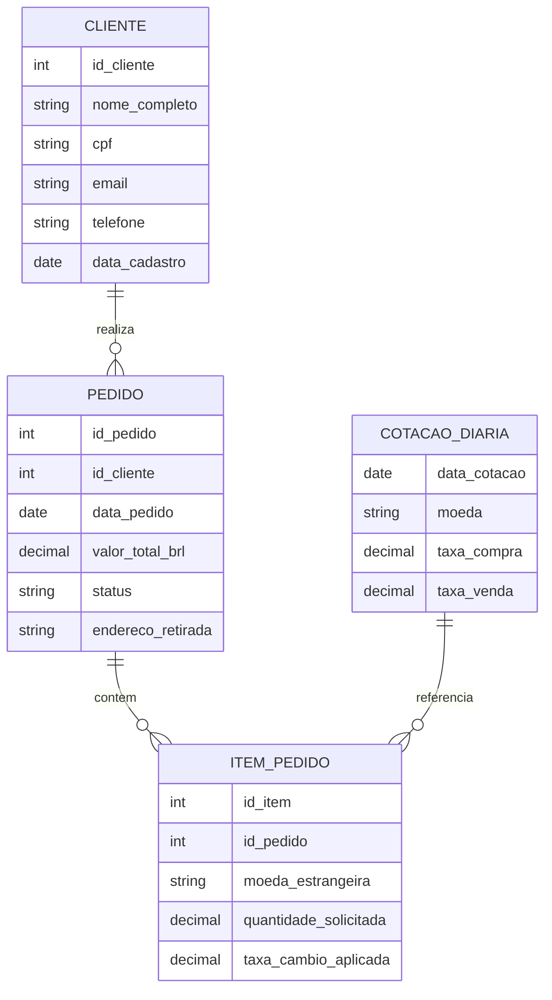

# Modelagem de Dados

## Modelo Conceitual

A modelagem conceitual identifica as principais entidades do negócio, seus atributos e como elas se relacionam — antes de qualquer detalhe de implementação técnica.

### Entidades e Atributos

**Cliente**
- `id_cliente` (identificador único)
- `nome_completo`
- `cpf`
- `email`
- `telefone`
- `data_cadastro`

**Pedido** (Operação de Câmbio)
- `id_pedido` (identificador único)
- `id_cliente` (referência ao Cliente)
- `data_pedido`
- `valor_total_brl`
- `status` (pendente / concluído / cancelado)
- `endereco_retirada`

**Item do Pedido**
- `id_item` (identificador único)
- `id_pedido` (referência ao Pedido)
- `moeda_estrangeira` (ex.: USD, EUR)
- `quantidade_solicitada`
- `taxa_cambio_aplicada`

**Cotação Diária** (origem: API PTAX do Banco Central)
- `data_cotacao`
- `moeda`
- `taxa_compra`
- `taxa_venda`

### Relacionamentos

- Um **Cliente** pode realizar **vários Pedidos** (1:N).
- Um **Pedido** pode conter **vários Itens de Pedido** (1:N) — por exemplo, um cliente solicitando dólar e euro no mesmo pedido.
- Cada **Item de Pedido** aplica a **taxa de câmbio vigente** na **Cotação Diária** correspondente à data do pedido.

---

## Do Conceitual ao Físico

Seguindo a progressão ensinada na Aula 05 (Conceitual → Lógico → Físico):

- **Conceitual**: as entidades e relacionamentos descritos acima, independentes de tecnologia.
- **Lógico**: cada entidade se torna uma tabela, com tipos de dados definidos, chaves primárias (`id_cliente`, `id_pedido`, `id_item`) e chaves estrangeiras (`id_cliente` em Pedido, `id_pedido` em Item_Pedido).
- **Físico**: as tabelas lógicas são implementadas no PostgreSQL, organizadas nas camadas Silver (estrutura próxima ao modelo lógico, normalizada) e Gold (estrutura desnormalizada em star schema).

## Relação com a Camada Gold (Star Schema)

Na camada Gold, este modelo conceitual é reorganizado em um **star schema (Kimball)**, otimizado para consultas de BI:

- **Tabela Fato**: `fato_pedido` — contém as métricas numéricas de cada operação (valor, quantidade, taxa aplicada).
- **Tabelas Dimensão**: `dim_cliente`, `dim_data` e `dim_moeda` — fornecem o contexto qualitativo (quem, quando, qual moeda) para a tabela fato.

Essa transformação do modelo conceitual/lógico (normalizado) para o star schema (desnormalizado) é realizada pelos modelos do `dbt` na passagem da camada Silver para a Gold.
